# Small Office Network Design using Cisco Packet Tracer

## Project Overview

This project simulates a small office network infrastructure using VLAN segmentation, Router-on-a-Stick inter-VLAN routing, DHCP configuration, and basic switch security.

The network is designed for a company with three departments:
- HR Department
- Finance Department
- IT Department

Each department is separated using VLANs while still allowing secure communication between VLANs through inter-VLAN routing.

---

# Objectives

- Design a scalable small office network
- Implement VLAN segmentation
- Configure trunking between switch and router
- Configure Router-on-a-Stick inter-VLAN routing
- Configure DHCP for automatic IP assignment
- Implement basic switch port security
- Test connectivity between departments

---

# Technologies Used

- Cisco Packet Tracer
- VLANs
- Router-on-a-Stick
- DHCP
- Trunking
- Port Security
- IPv4 Addressing

---

# Network Topology

## Full Topology Diagram

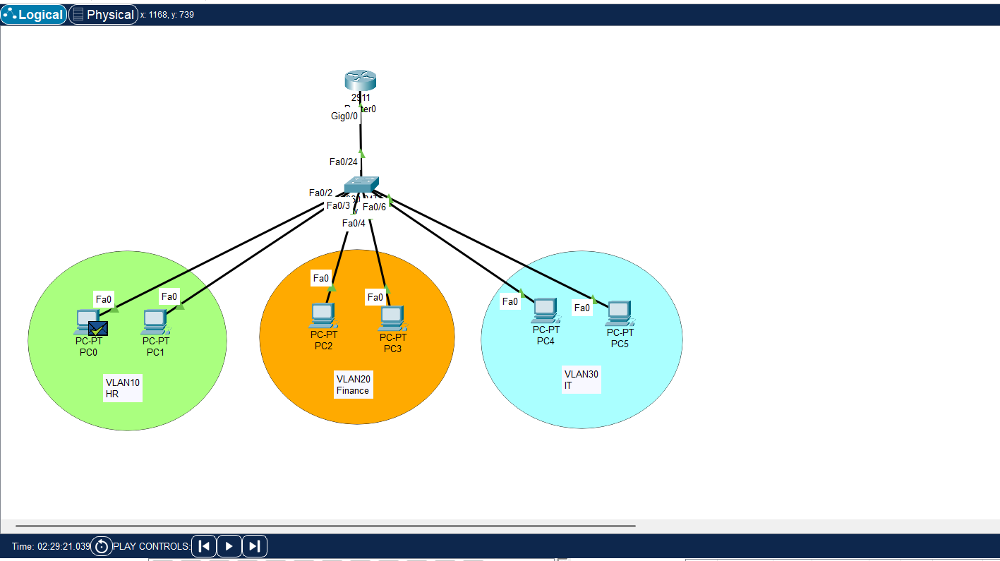

---

# Network Design

| Department | VLAN ID | Network Address | Default Gateway |
|------------|----------|----------------|----------------|
| HR         | 10       | 192.168.10.0/24 | 192.168.10.1 |
| Finance    | 20       | 192.168.20.0/24 | 192.168.20.1 |
| IT         | 30       | 192.168.30.0/24 | 192.168.30.1 |

---

# Devices Used

## Router
- Cisco 2911 Router

## Switch
- Cisco 2960 Switch

## End Devices
- 6 PCs
  - 2 HR PCs
  - 2 Finance PCs
  - 2 IT PCs

---

# Features Implemented

## VLAN Segmentation
Separate VLANs were created for each department to improve network organization and security.

### VLAN Configuration Screenshot

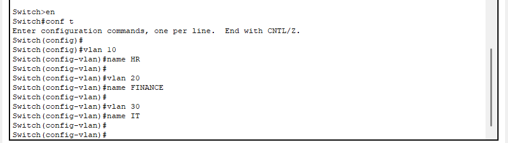
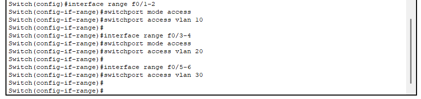

---

## Trunk Configuration
A trunk link was configured between the switch and router to allow VLAN traffic.

### Trunk Configuration Screenshot


---

## Router-on-a-Stick Inter-VLAN Routing
Subinterfaces were configured on the router for communication between VLANs.

### Router Configuration Screenshot

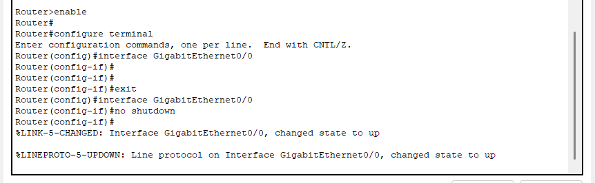
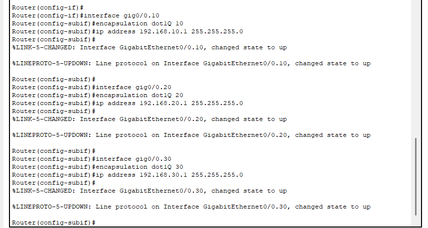

---

## DHCP Configuration
DHCP pools were configured on the router to automatically assign IP addresses to devices.

### DHCP Configuration Screenshot

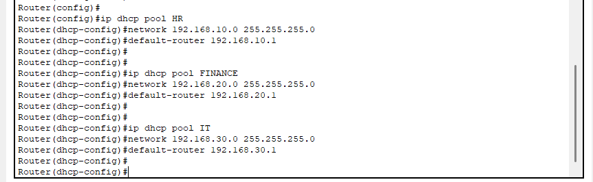

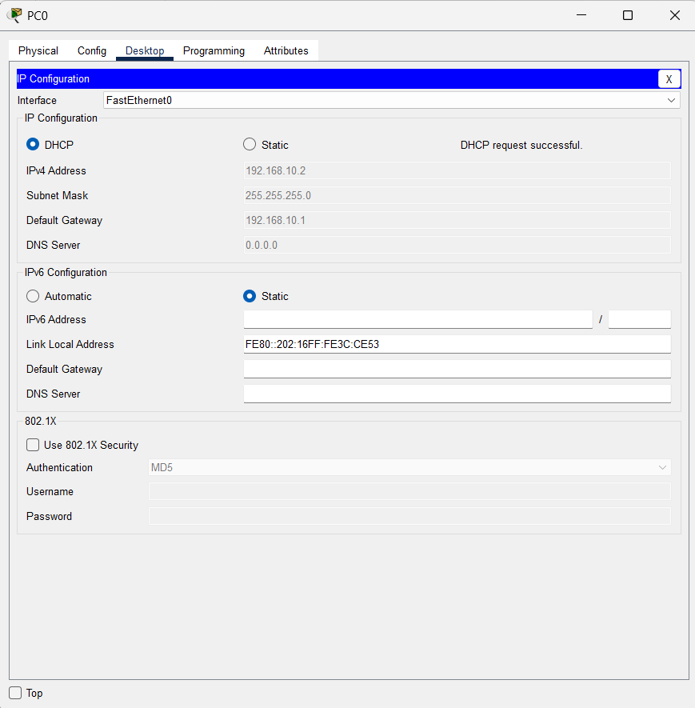
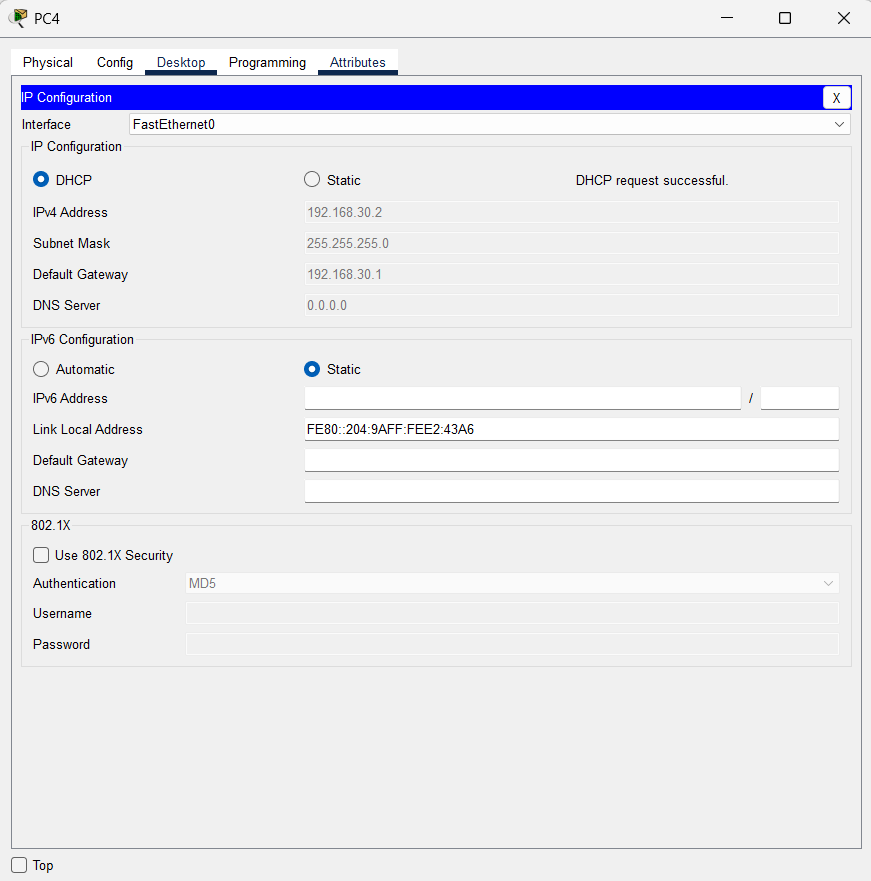

---

## Port Security
Basic switch port security was configured to improve access control.

### Port Security Screenshot

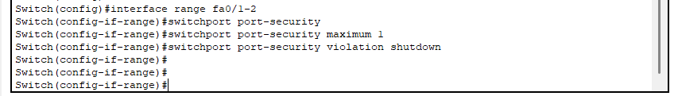

---

# Connectivity Testing

Connectivity tests were performed successfully between:
- Devices within the same VLAN
- Devices across different VLANs

### Ping Test Screenshot

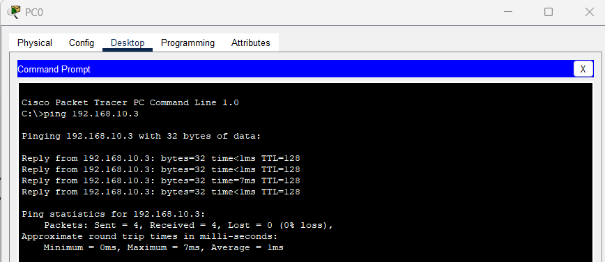

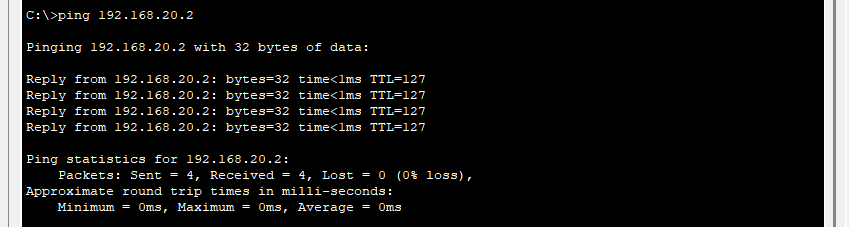

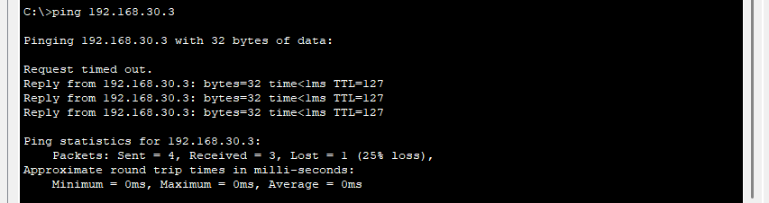

---

# Verification Commands Used

## Switch Commands

```bash
show vlan brief
show interfaces trunk
show port-security
```

## Router Commands

```bash
show ip interface brief
show ip route
show ip dhcp binding
```

---

# Skills Demonstrated

- Network Design
- VLAN Configuration
- Inter-VLAN Routing
- DHCP Configuration
- Switch Security
- Troubleshooting
- Cisco CLI Configuration

---

# Project Files

```text
small-office-network-design/
│
├── README.md
├── small-office-network.pkt
│
├── screenshots/
│   ├── 1-topology.png
│   ├── 2-vlan-config.png
│   ├── 3-Assign_Ports_to_VLANs.png
│   ├── 4-Configure_Trunk_Port.png
│   ├── 5-Enable_Interface.png
│   ├── 6-Create_Subinterfaces.png
│   ├── 7-Configure_DHCP.png
│   ├── 8-Configure_PCs.png
│   ├── 9-Configure_PCs.png
│   ├── 10-Test_Connectivity.png
│   ├── 11-Test_Connectivity.png
│   ├── 12-Test_Connectivity
│   └── 13-Configure_Port_Security
│
└── network-topology.png
```

---

# How to Run the Project

1. Open Cisco Packet Tracer
2. Open the file:
   `small-office-network.pkt`
3. Wait for devices to boot
4. Test connectivity using:
   - Ping commands
   - DHCP verification
   - VLAN verification

---

# Learning Outcomes

Through this project, I gained hands-on experience in:
- VLAN implementation
- Inter-VLAN communication
- Router-on-a-Stick configuration
- DHCP setup
- Network troubleshooting
- Basic network security

---

# Future Improvements

Possible future enhancements:
- Add wireless access points
- Configure ACLs
- Implement SSH remote access
- Add redundancy
- Configure network monitoring

---

# Author

Chamikara Jayasinghe

- ICT Undergraduate
- Network & Security Technology Student
- Cisco CCNA Certified

---
